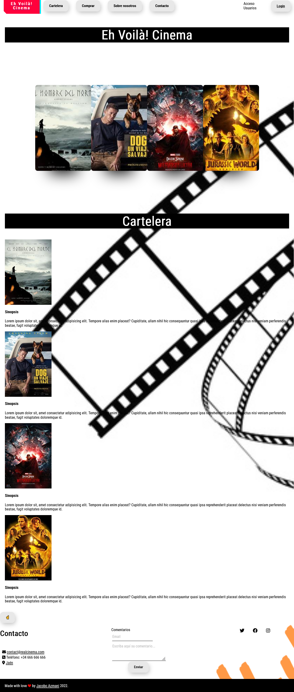

<a name="top"></a>

# Primer proyecto del curso de [General Assembly](https://generalassemb.ly/) de Front-End Developer.

> Jacobo Azmani
> Marzo 2022 - Julio 2022

## ÍNDICE

- [Primer proyecto del curso de General Assembly de Front-End Developer.](#primer-proyecto-del-curso-de-general-assembly-de-front-end-developer)
  - [ÍNDICE](#índice)
    - [Web de Cine, Cartelera y venta de entradas](#web-de-cine-cartelera-y-venta-de-entradas)
  - [Proyecto](#proyecto)
    - [Descripción del proyecto](#descripción-del-proyecto)
    - [Lenguajes de Diseño.](#lenguajes-de-diseño)
      - [HTML](#html)
      - [CSS](#css)
    - [Lenguajes de Programación](#lenguajes-de-programación)
      - [JavaScript](#javascript)
  - [Árbol de Directorios](#árbol-de-directorios)
  - [Bibliografía](#bibliografía)
      - [Lenguajes de diseño](#lenguajes-de-diseño-1)



### Web de Cine, Cartelera y venta de entradas

## Proyecto

El proyecto que quiero presentar se enfoca en una Web de ventas de entradas de cine. Mi objetivo es aplicar los conocimientos adquiridos a lo largo del curso como desarrollador web.

Me ha parecido interesante hacer una web sobre la venta de entradas y cartelera, ya que me gusta bastante el cine.

### Descripción del proyecto

Consiste en la realización de una web fictica de cine escrita en `HTML`, `CSS` y un poco de `javascript`.

En ella podrás ver la cartelera actual, comprar entradas y saber un poco sobre la sinopsis de la película. También he añadido un login para usuarios registrados que no he desarrollado ya que no era la finalidad principal del proyecto.

### Lenguajes de Diseño.

#### HTML

HTML, siglas de **Hyper Text Markup Language** (Lenguajede Marcas de Hipertexto), es
el lenguaje de marcado predominante para la construcción de páginas Web.

Es usado para describir la estructura y el contenido en forma de texto, así como para complementar el texto con objetos tales como imágenes. HTML se escribe en forma
de "etiquetas", rodeadas por corchetes angulares `(<,>)`. HTML también puede describir, hasta un cierto punto, la apariencia de un documento, y puede incluir un
script (por ejemplo JavaScript), el cual puede afectar el comportamiento de
navegadores Web y otros procesadores de HTML.

Por convención, los archivos de formato HTML usan la extensión `.htm` o `.html`.

#### CSS

Las hojas de estilo en cascada ( **Cascading Style Sheets**),CSS es un lenguaje artificial
usado para definir la presentación de un documento estructurado escrito en HTML o
XML (y por extensión en `XHTML`). El WWWC ( **World Wide Web Consortium**) es el
encargado de formular la especificación de las hojas de estilo que servirán de
estándar para los agentes de usuario o navegadores.

La idea que se encuentra detrás del desarrollo de CSS es separar la estructura de un
documento de su presentación. Esto ayuda a mejorar la experiencia del usuario con una
estética más uniforme y atractiva.

### Lenguajes de Programación

#### JavaScript

JavaScript es un lenguaje de programación interpretado, es decir, que no requiere
compilación. Es utilizado principalmente en páginas Web, con una sintaxis semejante a la del lenguaje Java y el lenguaje C y se considera un lenguaje orientado a objetos.

## Árbol de Directorios

```
App web Cine
  ├── README.md
  ├── assets
  │    └── images
  ├── scripts
  │     ├── index.js
  │     └── login.js
  ├── styles
  │      ├── css
  │      │   ├── main.css
  │      │   └── main.css.map
  │      └── sass
  │           ├── _footer.scss
  │           ├── _globlal.scss
  │           ├── _header.scss
  │           ├── _login.scss
  │           ├── _media.scss
  │           ├── _normalize.scss
  │           └── _main.scss
  ├── about.html
  ├── comprar.html
  ├── login.html
  └── index.html
```

## Bibliografía

#### Lenguajes de diseño

HTML Web. (2021). Retrieved 12 December 2021, from
https://www.w3schools.com/html/default.asp

CSS Tutorial. (2021). Retrieved 12 December 2021, from
https://www.w3schools.com/css/default.asp

[Subir](#top)

[](http://commonmark.org)
